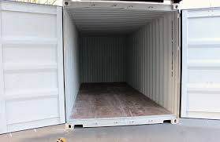

|  |  |  |
| :-: | :-: | :-: |
# Container for your next LoRa / LoRaWAN application

Everytime I get a new prototype module from RAK or a new application idea pops up in my mind, I start to create a new project folder, then copy all the basic functionality that I usually want from other projects into it.      
Kind of wasted time and easily leads to mistakes. So I thought if I have a ready to use project folder ( == Container) with all the basic functionality ready, that makes it much easier. Just copy the folder, rename it to whatever your application is doing and concentrate on the implementation of your application specific code.  

## Why call it a container?      
Let's image the container as a box that has all the basic functions already in it:     

    
The only thing I need to do is to write the application specific stuff and load it into the container.    

## Why two different containers for LoRa® and LoRaWAN®?
With a little bit effort, I could write the code in a way that it easily covers both scenarios, but for code readability and easier maintenance I separate it into two different containers.

## What are basic functions?
I do not know about you, but for me the essential functions are:
1. BLE OTA DFU for firmware updates
2. LoRa®/LoRaWAN® parameter setup over BLE
3. BLE UART (usually for wireless debug output)
4. Storing the parameters in a nonvolatile memory storage
5. Initialize LoRa®/LoRaWAN®   
6. Support for all LoRaWAN® regions
7. Timer for frequently performed actions
8. Event triggered loop to reduce the power consumption of the application

All of above I usually have in my applications and I do not want to rewrite it every time I start a new application.

(1), (2) (3) and (4) are going hand in hand together. I have already code blocks that initialize BLE with all services I usually need, and other code blocks that read or save parameters into the flash memory. 

(5) and (6) is always the same, initialize LoRa and then either start the join process (if LoRaWAN®), or just be ready to listen and send packets (LoRa® P2P)

And (7) and (8) are a standardized loop function that is sleeping until it gets woken up by an event.

# Let's look a little bit deeper into these "standard" functionality.

## Parameters
Here I have two different scenarios, depending whether I am working on a LoRa® P2P solution or using LoRaWAN®. The principle for both is the same, predefined structures hold all the required information and standardized functions write them to or read them from the nonvolatile memory. The difference is only in the content of the data structures. 

## Parameters in nonvolatile memory
All parameters can be preset in the **`main.h`** include file. 
I explain this in the [Parameter storage](./Parameter.md) document.

## AT command interface
Another method to set the parameters is over the USB connection with AT commands.
The manual for all AT commands is in the [AT Command Manual](./AT-Command.md)
After setting the parameters over with the AT commands, they are stored in the nonvolitale memory.

Using the AT commands avoids to have to create different binary files for different devices. You can keep the default settings and just setup each indivual device over the USB port.

## BLE services

This is simpler than it sounds. My "standard" BLE initialization is always with 3 default service characteristics:
1. OTA DFU service
2. LoRa® parameter settings service
3. BLE UART service  

These 3 services are always the same and are in **`ble.cpp`**. There is nothing in this file that would need to be changed for different applications. The BLE services work all with callback functions, process the data and only inform the loop() task with a flag if additional work has to be done.    

More details are in the [BLE-Services](./BLE_Services.md) document.  
  
## LoRa® / LoRaWAN®
  
This is as well an always repeating story. Initialize the LoRa transceiver, tell the under-laying library whether we want to use LoRa® P2P or LoRaWAN® and provide the event callbacks.   
  
I split this into two scenarios as well, again depending whether I need LoRa® P2P or LoRaWAN®.   
  
If written well, the event callbacks do not need to know anything about the application or what kind of data it is sending or receiving. This code part has a standard send packet function **`send_lora_packet(uint8_t *data, uint8_t size);`** and all it needs to know is a pointer to the data and the data size. And if a data packet was received, it copies the packet into a safe location and inform the loop() task about the event. The data handling is done in the loop() task.   
Read the [LoRa Handler](./Lora_Handler.md) document to learn more about the initialization procedure, the callbacks and the events.

## Timed events and event triggered loop()  

When we write quick and dirty in Arduino, we just let the loop() run and run and run. Just checking if a sensor has some data or if a packet has arrived over LoRa.     
But if we want to write an application that is concerned about power consumption, this is the worst thing to do. As a personal standard, in my applications I have the loop waiting for an event to happen and if nothing happens, just halt its execution. This is done with the help of FreeRTOS and semaphores. Time triggered events or communication events use a semaphore to wake up the loop(), tell it with a flag what events have happened and let the loop() handle them. After that, the loop goes back to sleep.  
Yes, I use the word _**sleep**_, because in nRF Arduino, if there are no events (like BLE) and all tasks are halted waiting for a semaphore, the MCU will go into sleep mode. That is the best way to lower the battery consumption.   
The explanation about events and where to place application specific code is in the [Events & Loop](./Events_Loop.md) document.

